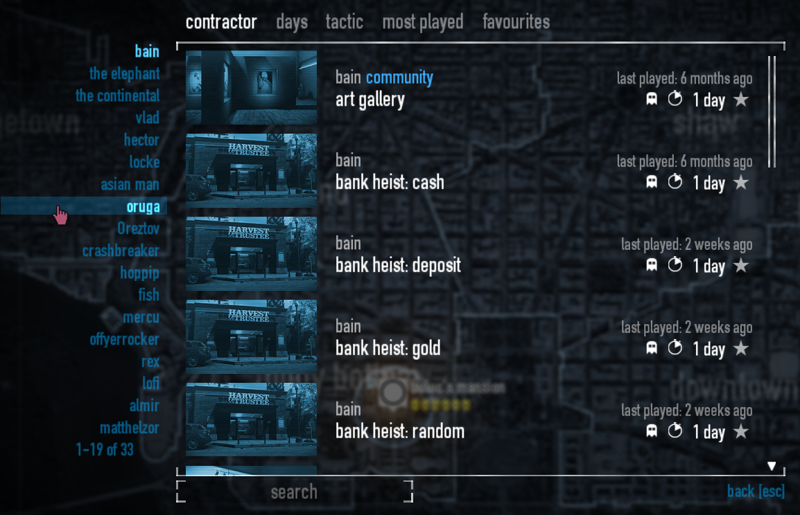
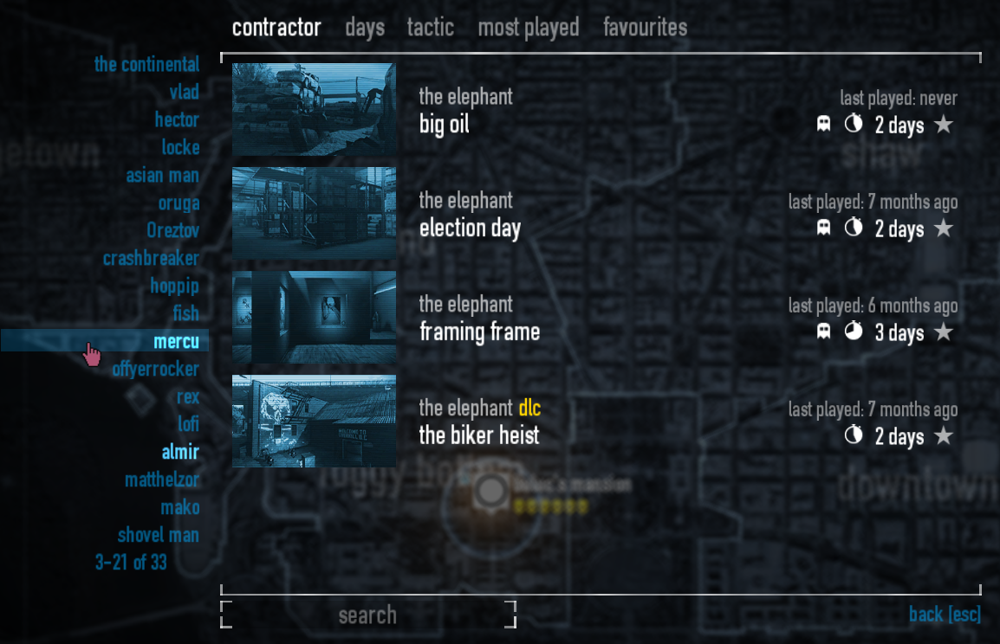

# Scrollable Contractors

do you have too many custom heists? can you not scroll to the bottom of the contractor list, leaving some maps inaccessible?

no?

well too bad, this mod will fix the problem you *do not have*!

----

  
<b>compatibility</b>

  should be compatible with everything that doesn't completely overhaul the contract broker UI.

## mirrors

[Github](https://github.com/theokrueger-mods/pd2-scrollable-contractors)

[Gitlab](https://gitlab.com/theokrueger-mods/pd2-scrollable-contractors)

[ModWorkshop](https://modworkshop.net/mod/37050)

## previews

## license

MIT, see [LICENSE](LICENSE)
